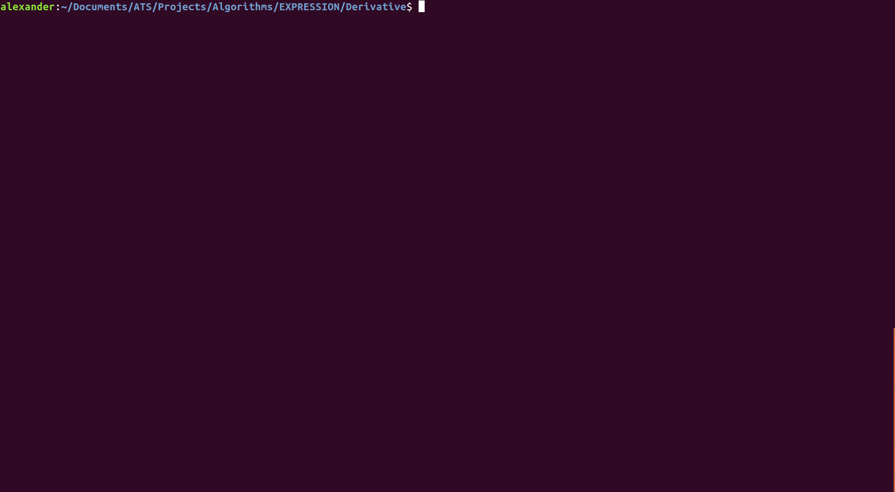

# EXPRESSION

Provides a way of creating and manipulating expressions involving a single variable X (for example polynomials in X). These expressions can be evaluated for a given X value, simplified given identity and distribution rules, and compared to other expressions for equality.

## Examples

### Struct + Evaluate

### Equality + Derivative

