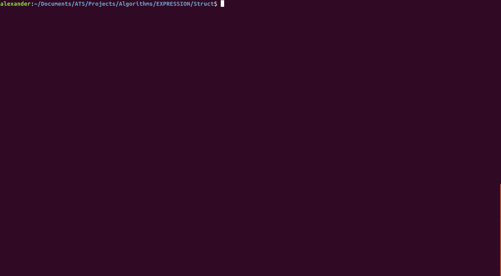
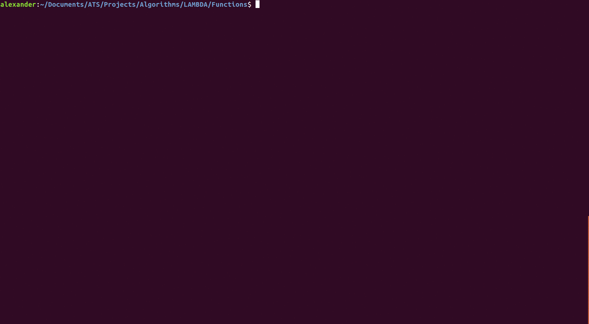
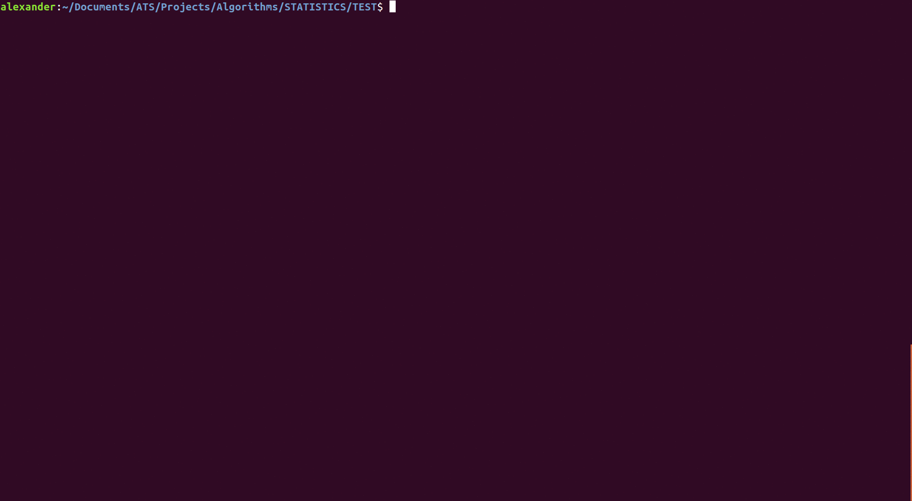
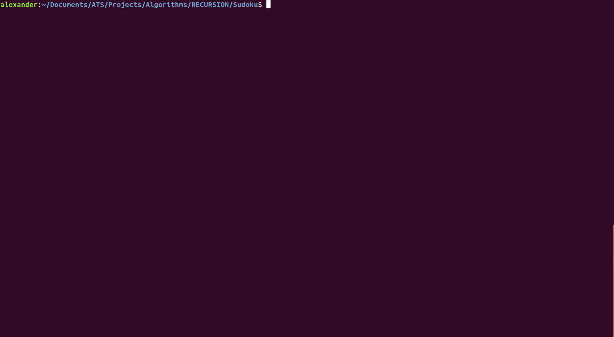

# magnificATS

A collection of various programming exercises I have done in ATS.

## Table of Content

   * [INTRO](#intro)
   * [EXPRESSION](#expression)
   * [LAMBDA](#lambda)
   * [ML](#ml)
   * [PROJECT EULER](#euler)
   * [RECURSION](#recursion)
   * [DIRECTORY INFO](#info)

### INTRO

[INTRO](./INTRO) contains some introductory examples and an article I wrote about ATS and Functional Programming.

### EXPRESSION

[EXPRESSION](./EXPRESSSION) provides a way of creating and manipulating expressions involving a single variable X (polynomials in X). These expressions can be evaluated for a given X value, simplified given identity and distribution rules, and compared to other expressions for equality.

### LAMBDA

[LAMBDA](./LAMBDA) is a small programming language that provides an interface for creating lambda functions and developing/ interpreting lambda calculus examples.

### ML

[ML](./ML) contains a library of basic statistical functions written in various styles, and a small neural network library.

### EULER

[PROJECTEULER](./PROJECTEULER) contains some project euler problems

### RECURSION

[RECURSION](./RECURSION) is a collection of algorithms written in a recursive style. You will find some dynamic programming, graph search, and other fun problems here.

### Info

#### Polyglot Output

    -------------------------------------------------------------------------------
     Language             Files       Lines         Code     Comments       Blanks
    -------------------------------------------------------------------------------
     ATS                    124       11537         9141          567         1829    
     Makefile                56        1968         1352            0          616
     Markdown                22         793          617            0          176
     Plaintext                4         202          202            0            0
    -------------------------------------------------------------------------------
     Total                  206       14500        11312          567         2621
    -------------------------------------------------------------------------------

#### Directory Tree

├── EXPRESSION  
│   ├── Derivative  
│   │   ├── deriv.dats  
│   │   └── Makefile  
│   ├── Equality  
│   │   ├── equal.dats  
│   │   ├── Makefile  
│   │   └── tests.dats  
│   ├── Evaluate  
│   │   ├── expr2.dats  
│   │   ├── Makefile  
│   │   └── tests.dats  
│   ├── GIF  
│   │   ├── tty2.gif  
│   │   └── tty.gif  
│   ├── README.md  
│   └── Struct  
│       ├── expr.dats  
│       ├── Makefile  
│       └── tests.dats  
├── INTRO  
│   ├── DepTypesIntro  
│   │   ├── array.dats  
│   │   ├── array_repr.dats  
│   │   ├── gte.dats  
│   │   ├── gte_unsafe.dats  
│   │   ├── list.dats  
│   │   ├── list_list.dats  
│   │   ├── matrix.dats  
│   │   └── mod.dats  
│   ├── Makefile_template  
│   ├── README.md  
│   ├── TEMPLATE  
│   │   ├── DATS  
│   │   │   └── template.dats  
│   │   ├── mylibies.dats  
│   │   ├── mylibies.sats  
│   │   ├── SATS  
│   │   │   └── template.sats  
│   │   └── TEST  
│   │       ├── Makefile  
│   │       └── test00.dats  
│   ├── template.dats  
│   └── triangle  
│       └── triangle.dats  
├── LAMBDA  
│   ├── Examples  
│   │   ├── basic.txt  
│   │   ├── fact.dats  
│   │   ├── fibo.dats  
│   │   ├── Makefile  
│   │   ├── prime.dats  
│   │   └── queens.dats  
│   ├── GIF  
│   │   └── tty.gif  
│   ├── Interpreter  
│   │   ├── helper_interp.dats  
│   │   ├── helper_subst.dats  
│   │   ├── lambda_interp.dats  
│   │   └── lambda_subst.dats  
│   ├── Makefile  
│   ├── mylibies.dats  
│   ├── Parser  
│   │   └── lisp_parser.dats  
│   ├── README.md  
│   ├── Struct  
│   │   ├── print_term.dats  
│   │   ├── print_val.dats  
│   │   ├── string_base.dats  
│   │   └── struct.dats  
│   └── test.dats  
├── LAZY  
│   ├── Sieve  
│   │   ├── Makefile  
│   │   └── sieve.dats  
│   ├── Sudoku  
│   │   ├── board.dats  
│   │   ├── get_board.dats  
│   │   ├── Makefile  
│   │   ├── mylibies.dats  
│   │   ├── print_board.dats  
│   │   ├── README.md  
│   │   ├── set_board.dats  
│   │   ├── sudoku.dats  
│   │   ├── test.dats  
│   │   └── valid_board.dats  
│   └── TheNats2  
│       ├── Makefile  
│       └── nats2.dats  
├── ML  
│   ├── NeuralNet  
│   │   ├── data  
│   │   │   ├── iris.csv  
│   │   │   ├── mnist_chunkaa  
│   │   │   ├── mnist_chunkab  
│   │   │   ├── mnist_chunkac  
│   │   │   ├── mnist_chunkad  
│   │   │   ├── mnist_chunkae  
│   │   │   ├── mnist_chunkaf  
│   │   │   ├── mnist_chunkag  
│   │   │   ├── mnist_chunkah  
│   │   │   ├── mnist_chunkai  
│   │   │   ├── mnist_chunkaj  
│   │   │   └── mnist_chunkak  
│   │   ├── mylibies.dats  
│   │   ├── README.md  
│   │   ├── src  
│   │   │   ├── matrix.dats  
│   │   │   ├── nniris.dats  
│   │   │   ├── nnmnist.dats  
│   │   │   ├── readcsv.dats  
│   │   │   └── stats.dats  
│   │   └── test  
│   │       ├── Makefile  
│   │       ├── test00.dats  
│   │       ├── test01.dats  
│   │       └── test02.dats  
│   └── Statistics  
│       ├── DATS  
│       │   └── stats.dats  
│       ├── GIF  
│       │   └── tty.gif  
│       ├── mylibies.dats  
│       ├── mylibies.sats  
│       ├── README.md  
│       ├── SATS  
│       │   └── stats.sats  
│       └── TEST  
│           ├── Makefile  
│           ├── test00.dats  
│           └── test01.dats  
├── myfile.txt  
├── PROJECTEULER  
│   ├── p01  
│   │   ├── Makefile  
│   │   └── mul35.dats  
│   ├── p02  
│   │   ├── fibo.dats  
│   │   └── Makefile  
│   ├── p03  
│   │   ├── lprime.dats  
│   │   ├── Makefile  
│   │   ├── package.json  
│   │   └── README.md  
│   ├── p04  
│   │   ├── lpalin.dats  
│   │   └── Makefile  
│   ├── p05  
│   │   ├── Makefile  
│   │   └── smallmul.dats  
│   ├── p06  
│   │   ├── Makefile  
│   │   └── sumsq.dats  
│   ├── p07  
│   │   ├── Makefile  
│   │   └── sieve.dats  
│   ├── p08  
│   │   ├── lprod.dats  
│   │   ├── Makefile  
│   │   ├── package.json  
│   │   └── README.md  
│   ├── p09  
│   │   ├── Makefile  
│   │   └── pytha.dats  
│   ├── p10  
│   │   ├── Makefile  
│   │   ├── package.json  
│   │   ├── psum.dats  
│   │   └── README.md  
│   ├── p11  
│   │   ├── grid.dats  
│   │   └── Makefile  
│   ├── p12  
│   │   ├── Makefile  
│   │   └── triang.dats  
│   ├── p13  
│   │   ├── intinf.dats  
│   │   ├── intinf.txt  
│   │   ├── Makefile  
│   │   ├── package.json  
│   │   └── README.md  
│   ├── p14  
│   │   ├── collatz.dats  
│   │   ├── Makefile  
│   │   ├── package.json  
│   │   └── README.md  
│   ├── p15  
│   │   ├── Makefile  
│   │   ├── package.json  
│   │   ├── paths.dats  
│   │   └── README.md  
│   ├── p16  
│   │   ├── digsum.dats  
│   │   ├── Makefile  
│   │   ├── package.json  
│   │   └── README.md  
│   ├── p17  
│   │   ├── letters.dats  
│   │   └── Makefile  
│   ├── p18  
│   │   ├── Makefile  
│   │   └── trpath.dats  
│   ├── p19  
│   │   ├── dates.dats  
│   │   └── Makefile  
│   ├── p20  
│   │   ├── fact.dats  
│   │   ├── Makefile  
│   │   ├── package.json  
│   │   └── README.md  
│   ├── p21  
│   │   ├── amicable.dats  
│   │   └── Makefile  
│   ├── p22  
│   │   ├── Makefile  
│   │   ├── names.dats  
│   │   ├── names.txt  
│   │   ├── package.json  
│   │   └── README.md  
│   ├── p23  
│   │   ├── abundant.dats  
│   │   └── Makefile  
│   ├── p24  
│   │   ├── Makefile  
│   │   └── perm.dats  
│   ├── p25  
│   │   ├── fibo.dats  
│   │   ├── Makefile  
│   │   ├── package.json  
│   │   └── README.md  
│   ├── p26  
│   │   ├── cycles.dats  
│   │   ├── Makefile  
│   │   └── README.md  
│   ├── p27  
│   │   ├── Makefile  
│   │   └── quadprime.dats  
│   └── p28  
│       ├── Makefile  
│       └── spiral.dats  
├── README.md  
└── RECURSION  
    ├── 2sum  
    │   ├── 2sum.dats  
    │   ├── Makefile  
    │   └── test.dats  
    ├── 3sum  
    │   ├── 3sum.dats  
    │   ├── Makefile  
    │   └── test.dats  
    ├── Factorial  
    │   ├── fact.dats  
    │   ├── factpf.dats  
    │   ├── factprop.dats  
    │   └── Makefile  
    ├── Fibonacci  
    │   ├── fibo.dats  
    │   ├── fibopf.dats  
    │   ├── fiboprop.dats  
    │   └── Makefile  
    ├── Loading  
    │   ├── loading.dats  
    │   └── Makefile  
    ├── NQueens  
    │   ├── GIF  
    │   │   ├── tty2.gif  
    │   │   └── tty.gif  
    │   ├── Makefile  
    │   └── nqueen.dats  
    ├── Palindrome  
    │   ├── drome.dats  
    │   └── Makefile  
    ├── Permutations  
    │   └── perm.dats  
    ├── README.md  
    ├── Roman  
    │   ├── Makefile  
    │   └── rnumerals.dats  
    ├── SimpleDB  
    │   ├── Makefile  
    │   └── Simple_database.dats  
    ├── Staircase  
    │   ├── Staircase3  
    │   │   ├── Makefile  
    │   │   └── stair3.dats  
    │   └── StaircaseM  
    │       └── stairM.dats  
    ├── Subsets  
    │   ├── Makefile  
    │   └── subset.dats  
    ├── Sudoku  
    │   ├── board.dats  
    │   ├── get_board.dats  
    │   ├── GIF  
    │   │   ├── tty2.gif  
    │   │   └── tty.gif  
    │   ├── Makefile  
    │   ├── mylibies.dats  
    │   ├── print_board.dats  
    │   ├── README.md  
    │   ├── set_board.dats  
    │   ├── sudoku.dats  
    │   ├── test.dats  
    │   └── valid_board.dats  
    ├── Trees  
    │   ├── bfs.dats  
    │   ├── checkbst.dats  
    │   ├── dfs.dats  
    │   ├── Makefile  
    │   ├── README.md  
    │   ├── tree.dats  
    │   └── tty.gif  
    └── Triangular  
        ├── Makefile  
        ├── package.json  
        ├── README.md  
        └── triangular.dats  
  
82 directories, 235 files

_____

Please visit [ats-lang.org](http://www.ats-lang.org/) for information about how to get started with ATS.
