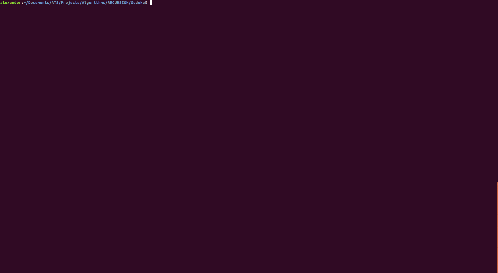

# RECURSION

Is a collection of algorithms written in a recursive style. You will find some dynamic programming, graph search, and other fun problems here.

## Examples

### Tree Search

### Sudoku Solver

(more coming soon)
